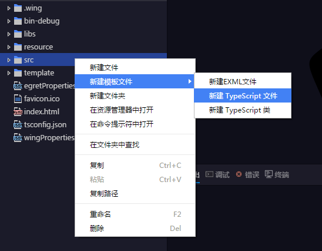
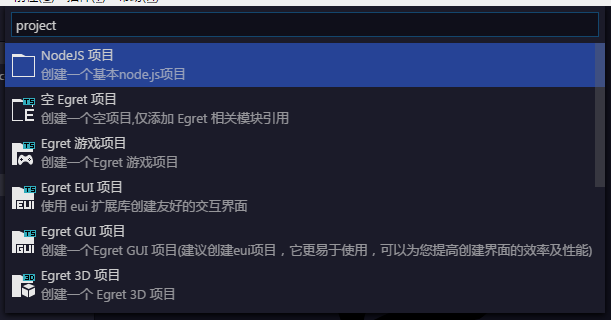

# template-provider

EgretWing从3.0.8开始，支持自定义模板项目和模板文件。

### registerTemplateFileProvider

注册文件模板。注册完成后在文件视图的文件夹上右键可以通过 `新建模板文件` 菜单创建模板。

### registerTemplateProjectProvider

注册项目模板。注册完成后，通过新建项目菜单可以看到注册的项目模板。

